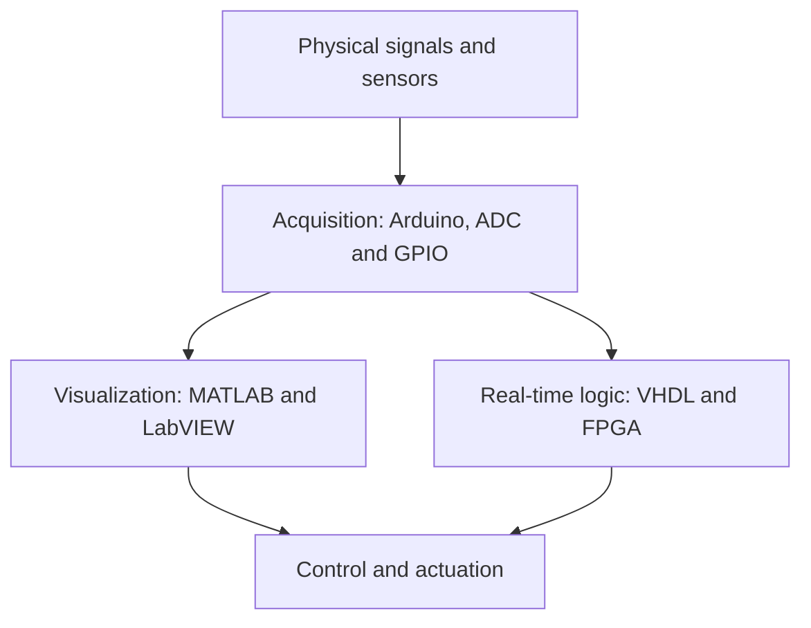

# Data Acquisition

**A collection of hands-on projects for acquiring, visualizing, processing and generating signals with Arduino, MATLAB, LabVIEW and FPGA/SoC platforms.**

[](LICENSE)
[](Arduino/)
[](Matlab/)
[](LabVIEW/)
[](VHDL/)

This repository is a **project collection rather than a single application**. It explores the complete path from physical variables and digital inputs to visualization, control and real-time hardware implementation:



The examples range from introductory sensor readers to FPGA–HPS communication on a Cyclone V SoC. They were developed at different points in time for learning, experimentation and academic work, so each folder should be treated as an independent project with its own hardware and software requirements.

> **Resumen en español:** colección de proyectos sobre adquisición, representación y generación de señales mediante Arduino, MATLAB, LabVIEW y VHDL. Incluye lectura de sensores, instrumentación gráfica, control de actuadores, interfaces digitales y diseños FPGA/SoC.

## Explore the collection

| Area | What it demonstrates | Main hardware / tools |
| --- | --- | --- |
| [Arduino](Arduino/) | Direct sensor acquisition and actuator control | Arduino Uno/Nano, DHT11, 28BYJ-48, ULN2003 |
| [MATLAB](Matlab/) | Host-side acquisition, conversion and real-time plotting | MATLAB, Arduino Support Package, analog and digital sensors |
| [LabVIEW](LabVIEW/) | Graphical instrumentation and small control-system simulations | LabVIEW, Arduino, LM35, photoresistor, DHT11 |
| [VHDL](VHDL/) | Digital I/O, ADC, PWM, serial buses and FPGA–HPS integration | Intel/Altera Quartus, Qsys/Platform Designer, Cyclone V, DE10-Nano |

## Arduino projects

The Arduino track contains small, self-contained embedded projects that interface directly with sensors and actuators.

| Project | Description | Key components |
| --- | --- | --- |
| [DHT11 Reader](Arduino/DHT11-Reader/) | Reads ambient temperature and relative humidity and sends the measurements over the serial interface. | Arduino Uno, DHT11 |
| [Watch Winder](Arduino/Watch_Winder/) | Drives an automatic-watch winder through alternating clockwise and counter-clockwise motor cycles. | Arduino Nano, 28BYJ-48 stepper motor, ULN2003 driver |

The watch-winder folder includes the firmware and circuit information. A complete mechanical and electronic build guide is also available in the related article: [DIY automatic watch winder](https://jagumiel.xyz/blog/2021/03/21/watch-winder-cargador-de-relojes-automaticos/) (Spanish).

## MATLAB projects

These examples use MATLAB as the acquisition and visualization layer, normally with an Arduino acting as the hardware interface.

| Project | Purpose |
| --- | --- |
| [Graph Voltimeter](Matlab/Graph_Voltimeter/) | Samples an Arduino analog input and plots voltage against time. |
| [Photoresistor Reader](Matlab/Lectura_fotoresistencia/) | Converts the voltage measured across a photoresistor circuit into an estimated illuminance value and plots it in real time. |
| [DHT11 Sensor](Matlab/Sensor_DHT11/) | Combines Arduino firmware with a MATLAB script to acquire temperature and humidity data through the serial link. |
| [Temperature Reader](Matlab/Temp_Reader/) | Contains two approaches for reading an LM35 temperature sensor: Arduino plus MATLAB and a MATLAB-side Arduino connection. |
| [Transistor Comparison](Matlab/Transistor_Cmp/) | Plots transistor characteristic curves to help compare devices. |

Most MATLAB examples predate automatic hardware discovery and may contain fixed serial-port or board settings. Check those values before running a script.

## LabVIEW projects

The LabVIEW track explores graphical data acquisition and control through Arduino-connected sensors.

| Project | Purpose |
| --- | --- |
| [Temperature Reader](LabVIEW/temp_reader/) | Reads temperature data through Arduino as an introductory LabVIEW acquisition exercise. |
| [Car Simulation](LabVIEW/car_simulation/) | Simulates automatic vehicle lighting and climate-control behaviour using light and temperature measurements. |

The car simulation was developed as a university assignment and is described in more detail in [Automotive automation simulation in LabVIEW](https://jagumiel.xyz/blog/2018/04/10/simulacion-de-automatismos-en-labview/) (Spanish).

These projects rely on legacy LabVIEW–Arduino integration components. Compatibility depends on the LabVIEW version and the toolkit installed on the host.

## VHDL and FPGA/SoC projects

[VHDL](VHDL/) is the largest part of the repository. It progresses from basic board-level experiments to heterogeneous systems in which programmable logic and an embedded processor cooperate.

### Digital logic and board I/O

Examples cover push-buttons, switches, LEDs and GPIO access:

- [`pruebaKey`](VHDL/pruebaKey/), [`pruebaSumaKey`](VHDL/pruebaSumaKey/) and [`pruebaLeds`](VHDL/pruebaLeds/) for introductory input/output logic.
- [`pruebaLedsCont`](VHDL/pruebaLedsCont/) for sequential LED control.
- [`pruebaEscrituraGPIO`](VHDL/pruebaEscrituraGPIO/), [`pruebaLecturaGPIO`](VHDL/pruebaLecturaGPIO/), [`pruebaRW-GPIO`](VHDL/pruebaRW-GPIO/) and [`sistemaGPIO`](VHDL/sistemaGPIO/) for GPIO experiments.

### Acquisition, control and signal generation

- [`pruebaOnBoardADC`](VHDL/pruebaOnBoardADC/), [`pruebaADC_IP`](VHDL/pruebaADC_IP/) and [`pruebaADC_Qsys`](VHDL/pruebaADC_Qsys/) explore ADC acquisition using direct logic and system-integration components.
- [`pruebaPWM`](VHDL/pruebaPWM/), [`pruebaAnalogPWM`](VHDL/pruebaAnalogPWM/) and [`spwm_gen`](VHDL/spwm_gen/) cover PWM and sinusoidal PWM generation.
- [`temp_ctrl`](VHDL/temp_ctrl/) applies acquisition and output control to a temperature-control experiment.

### Digital communications

- [I²C](VHDL/I2C/) contains separate write, read and combined read/write stages.
- [`pruebaSPI_RW`](VHDL/pruebaSPI_RW/) explores SPI transactions.
- [`pruebaLVDS_Tx`](VHDL/pruebaLVDS_Tx/) and [`pruebaLVDS_TxRx`](VHDL/pruebaLVDS_TxRx/) cover LVDS transmission and reception.

### FPGA–HPS and SoC integration

The [HPS-FPGA-SoC](VHDL/HPS-FPGA-SoC/) collection uses the Cyclone V FPGA fabric together with its Hard Processor System:

| Project group | What it explores |
| --- | --- |
| `demo_led`, `demo_sw`, `demo_led_sw_*` | Reading switches and controlling LEDs from either the HPS, the FPGA or both. |
| `hps_adc`, `hps_adc_IPCore` | Acquiring ADC data in the FPGA and making it available to software running on the HPS. |
| `hps_fpga_key`, `pingPong` | FPGA–HPS signal paths and latency measurements. |
| `IRQ-Interrupts` | Interrupt-driven communication experiments. |
| `ADC_WEBSERVER` | Connecting data acquisition with a software-facing service. |
| `PWM_Simple_Configurable_Retardo`, `spwm_gen_soc_variable` | Software-configurable waveform-generation experiments. |

Additional folders include an earlier [FPGA-SoC](VHDL/FPGA-SoC/) integration project, Qsys/Nios experiments and [Enclustra](VHDL/Enclustra/) project templates and I/O control examples.

## Hardware and software

No single setup is required for the entire repository. Select a project first and then review its files and local documentation.

Typical requirements include:

- Arduino Uno or Nano.
- DHT11 temperature/humidity sensor.
- LM35 temperature sensor.
- Photoresistor and suitable resistor network.
- 28BYJ-48 stepper motor with ULN2003 driver.
- Terasic DE10-Nano or another compatible Cyclone V SoC board.
- Arduino IDE.
- MATLAB with the appropriate Arduino Support Package.
- NI LabVIEW with a compatible Arduino interface toolkit.
- Intel/Altera Quartus and, for system-level designs, Qsys/Platform Designer.
- A Linux image for the HPS examples; the original projects reference the historical Angström environment.

Hardware pin assignments, target devices and generated IP may be tied to the board and tool version used when each project was created. Review the relevant `.qsf`, `.qsys`, source and documentation files before programming a device.

## Getting started

Clone the collection:

```bash
git clone https://github.com/jagumiel/Data-Acquisition.git
cd Data-Acquisition
```

Then:

1. Choose one of the four technology tracks.
2. Open the selected project folder and read any local `README.md` or instructions.
3. Confirm the required board, sensors, pin assignments and software version.
4. Inspect the source before connecting or programming hardware.
5. Build or run the project using its native environment.

Because the folders contain independent experiments, there is no repository-wide build command.

## Repository status

This is an educational and experimental archive assembled over several years. It is useful as a reference and as a record of progressively more advanced data-acquisition work, but it is **not a unified production framework**.

Known areas for future improvement include:

- Add a consistent `README.md` to every project, including wiring, exact versions and expected output.
- Correct and expand the documentation for the LabVIEW car simulation.
- Separate handwritten FPGA sources from Quartus/Qsys-generated artifacts.
- Verify projects with current Arduino, MATLAB, LabVIEW and Quartus releases.
- Add reproducible build instructions and testbenches where practical.
- Reduce the repository size after confirming that generated FPGA content can be recreated reliably.

## Related technical articles

- [Watch winder: automatic watch charger](https://jagumiel.xyz/blog/2021/03/21/watch-winder-cargador-de-relojes-automaticos/)
- [Automotive automation simulation in LabVIEW](https://jagumiel.xyz/blog/2018/04/10/simulacion-de-automatismos-en-labview/)

The articles are written in Spanish and provide additional hardware, circuit and implementation context.

## License

This repository is licensed under the [MIT License](LICENSE).

